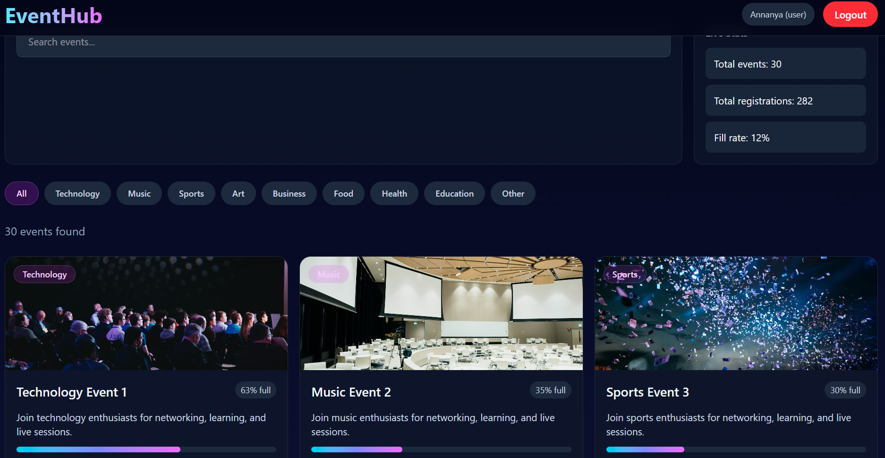
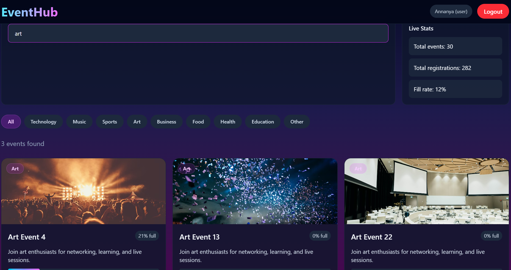
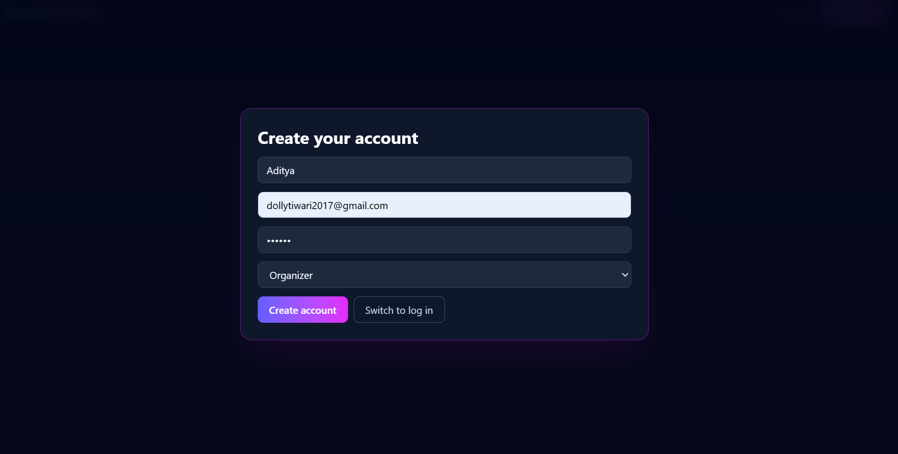
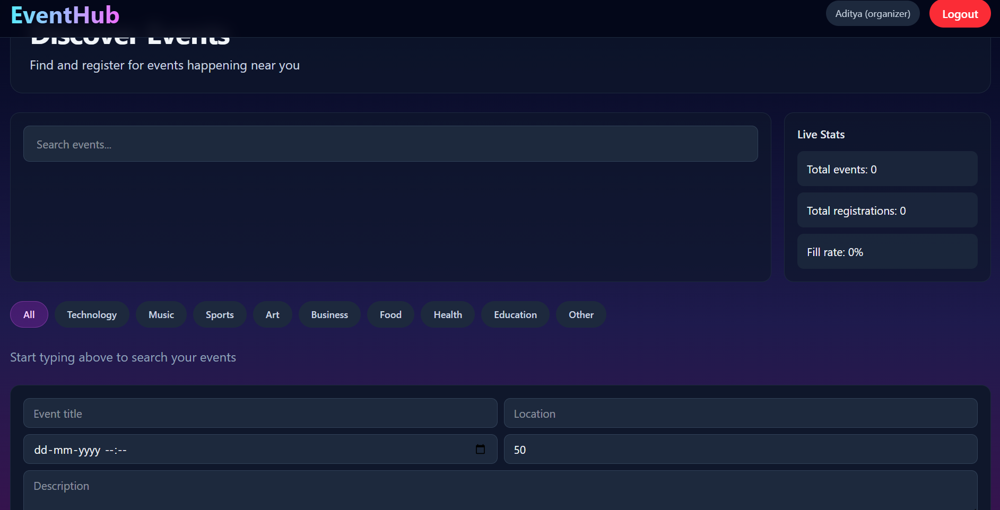

## EventHub – Real-Time Event Management System  

Developed a full-stack event management platform enabling users to create and register for events with real-time updates.  

• Implemented RESTful APIs using Node.js and Express  
• Integrated MongoDB for efficient event and registration data management  
• Built real-time registration tracking using Socket.io  
• Designed responsive UI using React  

---

## ✨ Features

- 🧑‍💼 Event Creation (Organizer)
- 📋 Event Listings
- 📝 User Registration for Events
- ⚡ Real-time Registration Updates (Socket.io)
- 📊 Capacity Tracking for Each Event
- 🔔 Notification System for event updates

---

## 🛠 Tech Stack

**Frontend:**
- React
- Tailwind CSS 

**Backend:**
- Node.js
- Express.js

**Database:**
- MongoDB

**Real-time:**
- Socket.io

---
## 📁 Project Structure

EventHub/
├── backend/                                # Backend - Node.js + Express
│   ├── models/                             # MongoDB schemas (Event, Registration)
│   ├── server.js                           # Server entry point
│   ├── package.json
│
├── frontend/                                # Frontend - React (Vite)
│   ├── src/
│   │   ├── components/                       # Reusable UI components (EventCard, Navbar)
│   │   ├── App.jsx                            # Main app component
│   │   ├── main.jsx                            # Entry point
│   ├── index.html
│   ├── package.json
│
├── assets/                                    # Screenshots for README
├── README.md                                  # Project documentation
├── .gitignore
```

---

### 🏠 Dashboard



### 🔐 Login / Signup


### 🧑‍💼 Organizer Panel


---

## 📦 Installation & Setup

### 1. Clone Repository

git clone https://github.com/annanya111/EventHub.git
cd EventHub

---

### 2. Setup Backend

cd backend
npm install
node server.js

---

### 3. Setup Frontend

cd frontend
npm install
npm run dev

---

## 🌐 API Endpoints

### 📌 Event APIs
- `POST /events` → Create a new event  
- `GET /events` → Fetch all events  

### 📌 Registration API
- `POST /register/:id` → Register for an event  

### 📝 Example Request

POST /events
{
  "title": "Hackathon",
  "capacity": 100
}

## 🚀 Future Improvements

- 🔐 Proper Authentication using JWT
- 🎟 Paid Events Integration
- 📧 Email Notifications
- 📱 QR Code Check-in System

---

## 💡 Key Highlight

> Real-time event registration system using Socket.io ensures instant updates across all users without refreshing the page.

---

## 👩‍💻 Author

**Annanya Tiwari**
